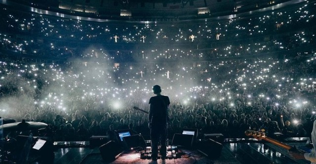
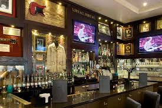
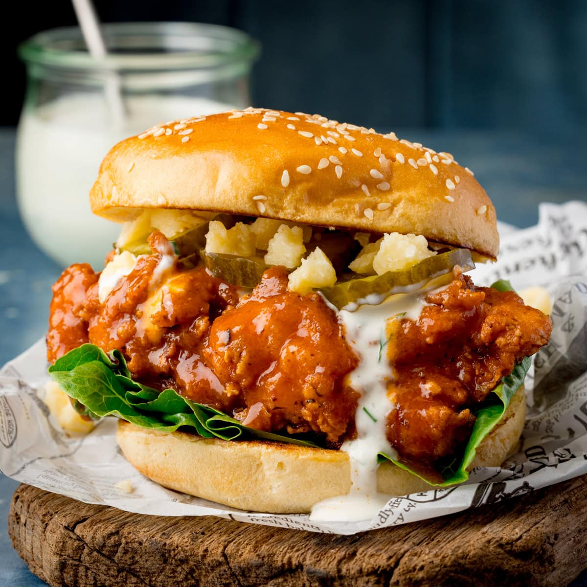
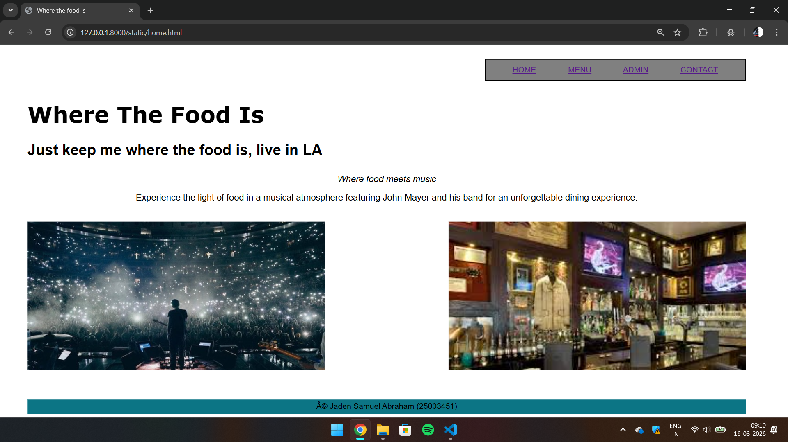
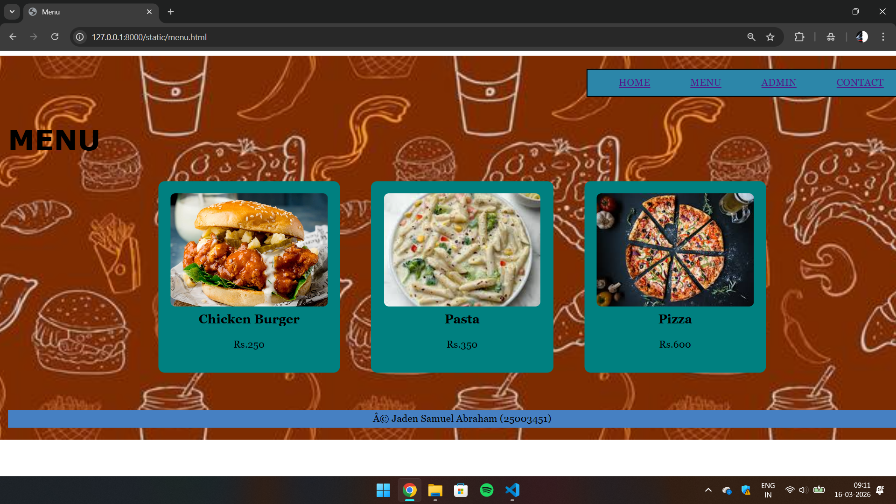
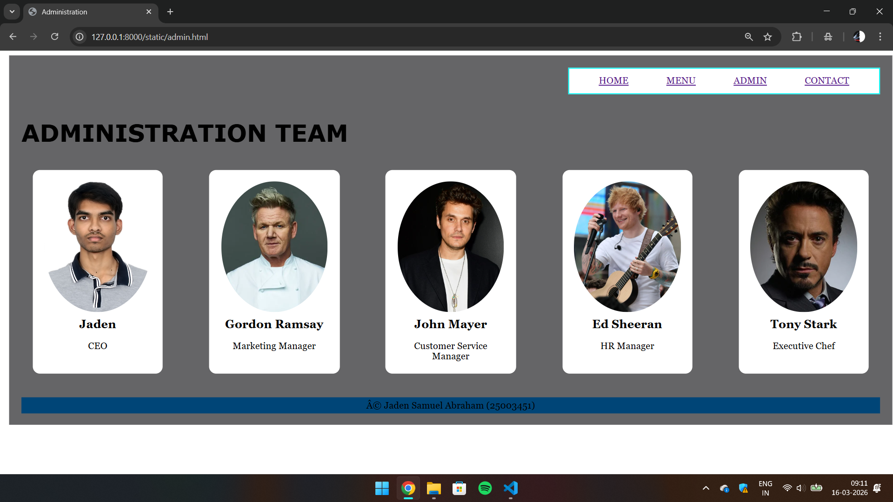
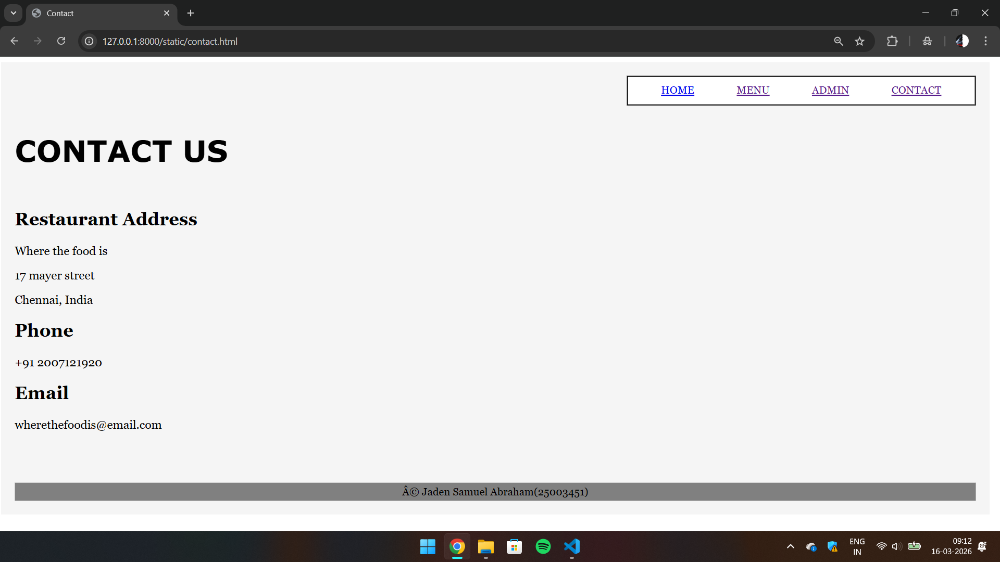

# Ex.06 Restaurant Website
## Date: 16/03/26

## AIM:
To develop a static Restaurant website to display the food items and services provided by them.

## DESIGN STEPS:

### Step 1:
Requirement collection.

### Step 2:
Creating the layout using HTML and CSS.

### Step 3:
Updating the sample content.

### Step 4:
Choose the appropriate style and color scheme.

### Step 5:
Validate the layout in various browsers.

### Step 6:
Validate the HTML code.

### Step 7:
Publish the website in Localhost.

## PROGRAM:
```
Home HTML
<html>

<head>
<title>Where the food is</title>
<link rel="stylesheet" href="main.css">
</head>

<body>
    
<div class="container">

<div class="navbar">
<a href="home.html">HOME</a>
<a href="menu.html">MENU</a>
<a href="admin.html">ADMIN</a>
<a href="contact.html">CONTACT</a>
</div>

<h1 class="title">Where The Food Is</h1>

<h2 class="tagline">Just keep me where the food is, live in LA</h2>

<div class="description">
<i>Where food meets music</i>
<p>
Experience the light of food in a musical atmosphere featuring John Mayer and his band for an unforgettable dining experience.
</p>
</div>

<div class="gallery">





</div>

<div class="footer">
© Jaden Samuel Abraham (25003451)
</div>

</div>

</body>
</html>

Home CSS

.container{
width:1450px;
margin:auto;
padding:20px;
font-family:Arial, Helvetica, sans-serif;
}

.navbar{
width:500px;
margin-left:auto;
border:2px solid black;
background:grey;
padding:12px;
text-align:center;
word-spacing:60px;
}

.title{
font-size:45px;
margin-top:40px;
font-family:Verdana;
}

.tagline{
font-size:30px;
margin-top:20px;
}

.description{
text-align:center;
margin-top:30px;
font-size:18px;
}

.gallery{
display:flex;
justify-content:space-between;
margin-top:40px;
}

.gallery img{
width:600px;
height:300px;
object-fit:cover;
}

.footer{
margin-top:60px;
background:rgb(12, 117, 133);
text-align:center;
padding:5px;
}


Menu HTML

<html>

<head>
<title>Menu</title>
<link rel="stylesheet" href="food.css">
</head>

<body>

<div class="layout">

<div class="navigation">
<a href="home.html">HOME</a>
<a href="menu.html">MENU</a>
<a href="admin.html">ADMIN</a>
<a href="contact.html">CONTACT</a>
</div>

<h1 class="menuTitle">MENU</h1>

<div class="foodList">

<div class="food">

<h3>Chicken Burger</h3>
<p>Rs.250</p>
</div>

<div class="food">

<h3>Pasta</h3>
<p>Rs.350</p>
</div>

<div class="food">

<h3>Pizza</h3>
<p>Rs.600</p>
</div>

</div>

<div class="footer">
© Jaden Samuel Abraham (25003451)
</div>

</div>

</body>
</html>

Menu CSS

.layout{
width:1450px;
margin:auto;
padding:20px;
font-family:Georgia;
background-color: cornflowerblue;
background-size:cover;
}

.navigation{
width:500px;
margin-left:auto;
border:2px solid black;
background:rgb(44, 134, 169);
padding:12px;
text-align:center;
word-spacing:60px;
}

.menuTitle{
font-size:45px;
margin-top:40px;
font-family:Verdana;
}

.foodList{
display:flex;
justify-content:center;
gap:50px;
margin-top:40px;
}

.food{
background:teal;
padding:20px;
border-radius:10px;
text-align:center;
width:250px;
}

.food img{
width:100%;
height:180px;
object-fit:cover;
border-radius:8px;
}

.food h3{
margin-top:10px;
font-size:20px;
}

.footer{
margin-top:60px;
background:#4680c2;
text-align:center;
padding:5px;
}


Admin HTML

<html>
<head>
<title>Administration</title>
<link rel="stylesheet" href="team.css">
</head>

<body>

<div class="wrapper">

<div class="nav">
<a href="home.html">HOME</a>
<a href="menu.html">MENU</a>
<a href="admin.html">ADMIN</a>
<a href="contact.html">CONTACT</a>
</div>

<h1 class="heading">ADMINISTRATION TEAM</h1>

<div class="team">

<div class="member">

<h2>Jaden</h2>
<span>CEO</span>
</div>

<div class="member">

<h2>Gordon Ramsay</h2>
<span>Marketing Manager</span>
</div>

<div class="member">

<h2>John Mayer</h2>
<span>Customer Service Manager</span>
</div>

<div class="member">

<h2>Ed Sheeran</h2>
<span>HR Manager</span>
</div>

<div class="member">

<h2>Tony Stark</h2>
<span>Executive Chef</span>
</div>

</div>

<div class="footer">
© Jaden Samuel Abraham (25003451)
</div>

</div>

</body>
</html>

Admin CSS

.wrapper{
width:1450px;
margin:auto;
padding:20px;
font-family:Georgia, serif;
background-color: rgb(101, 101, 103);
background-size:cover;
}

.nav{
width:500px;
margin-left:auto;
border:2px solid rgb(0, 255, 251);
background:white;
text-align:center;
padding:12px;
word-spacing:60px;
}

.heading{
font-size:40px;
margin-top:40px;
font-family:Verdana;
}

.team{
display:flex;
justify-content:space-around;
flex-wrap:wrap;
margin-top:40px;
gap:40px;
}

.member{
background:white;
padding:20px;
border-radius:12px;
text-align:center;
width:180px;
}

.member img{
width:100%;
height:220px;
object-fit:cover;
border-radius:50%;
}

.member h2{
margin-top:10px;
font-size:20px;
}

.member span{
font-size:16px;
}

.footer{
margin-top:40px;
background:rgb(0, 69, 119);
text-align:center;
padding:5px;
}


Contact HTML

<html>

<head>
<title>Contact</title>
<link rel="stylesheet" href="contactstyle.css">
</head>

<body>

<div class="page">

<div class="topnav">
<a href="rest.html">HOME</a>
<a href="menu.html">MENU</a>
<a href="admin.html">ADMIN</a>
<a href="contact.html">CONTACT</a>
</div>

<h1 class="contactTitle">CONTACT US</h1>

<div class="contactBox">

<div class="details">
<h2>Restaurant Address</h2>
<p>Where the food is</p>
<p>17 mayer street</p>
<p>Chennai, India</p>

<h2>Phone</h2>
<p>+91 2007121920</p>

<h2>Email</h2>
<p>wherethefoodis@email.com</p>
</div>

</div>

<div class="footer">
© Jaden Samuel Abraham(25003451)
</div>

</div>

</body>
</html>

Contact CSS

.page{
width:1450px;
margin:auto;
padding:20px;
font-family:Georgia;
background:#f5f5f5;
}

.topnav{
width:500px;
margin-left:auto;
border:2px solid black;
background:white;
padding:12px;
text-align:center;
word-spacing:60px;
}

.contactTitle{
font-size:45px;
margin-top:40px;
font-family:Verdana;
}

.contactBox{
display:flex;
justify-content:space-between;
margin-top:40px;
gap:60px;
}

.details{
width:40%;
font-size:18px;
}

.formArea{
width:50%;
}

form{
display:flex;
flex-direction:column;
gap:15px;
}

input{
padding:10px;
font-size:16px;
border:1px solid gray;
}

textarea{
height:120px;
padding:10px;
font-size:16px;
border:1px solid gray;
}

button{
padding:10px;
font-size:16px;
background:black;
color:white;
border:none;
cursor:pointer;
}

button:hover{
background:#444;
}

.footer{
margin-top:60px;
background:gray;
text-align:center;
padding:5px;
}
```
## OUTPUT:




## RESULT:
The program for designing software company website using HTML and CSS is completed successfully.
